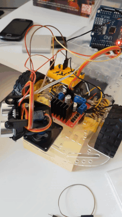

## Robot car with ATmega328p (Arduino chip), made with :package: avr-hal

Working with Rahix's avr-hal to make a little robot :car:🐯 with 📡.

11/08/2020:
Implemented the sensor and the wheels.

TODO:
- Continue to organise in structs/Rusty style (the wheels could be passed in a single struct)

✅ Implement PWM for servo motors

- It would not hurt to re-solder the cables

