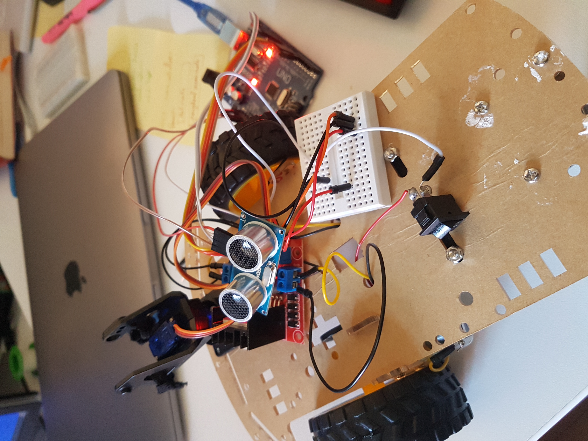

# avr-example
avr-example (Rahix)

Working with Rahix's avr-hal to connect a sensor on the Arduino uno board 📡.

10/08/2020:
Implemented the sensor and the wheels.

TODO:
- Organise in structs/Rusty style
- Implement PWM for servo motors
- It would not hurt to re-solder the cables
