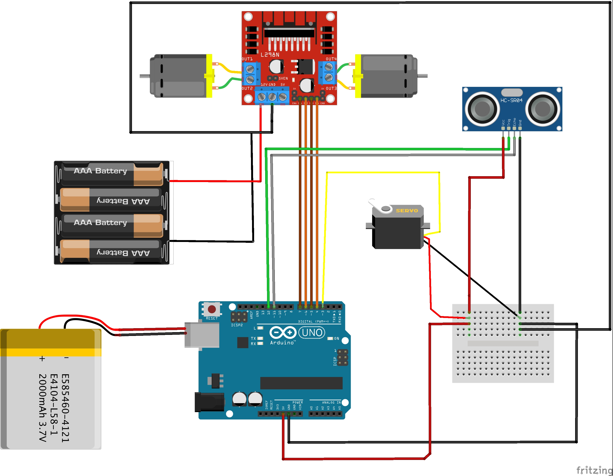

## Robot car with ATmega328p (Arduino chip), made with :package: avr-hal

Working with Rahix's avr-hal to make a little robot :car:🐯 with 📡.

The circuit diagram is below:

<div>

  </div>

## Stuff:

**If you are not used to/have no access to cheap electronic parts**: 🛍🛒 You can also order a kit from Banggood or Ebay. Just search _2WD obstacle avoiding robot kit_, there are many, many, many suppliers. Example: [Ebay UK](https://www.ebay.co.uk/itm/Smart-Car-Motor-Robot-Chassis-Ultrasonic-Module-Battery-Box-Kit-2WD-For-Arduino/174299467397?hash=item28950ece85:g:gy8AAOSwRh9e0P8z), [Banggood](https://www.banggood.com/Geekcreit-DIY-L298N-2WD-Ultrasonic-Smart-Tracking-Moteur-Robot-Car-Kit-for-Arduino-products-that-work-with-official-Arduino-boards-p-1155139.html?rmmds=search&cur_warehouse=CN)...
- Also, there are great tutorials [on assembling those robots](https://www.youtube.com/watch?v=BH33F-Hi_2M&list=PLN9tittQZUlRJCdE17eORJ7ZGVhGnH77k&index=3)!

**If you love picking up electronics yourself**:
- Arduino UNO or Nano, or any clone using ATmega328p
- [Servo SG90](https://components101.com/servo-motor-basics-pinout-datasheet)
- [2 DC motors 12V](http://robotechshop.com/shop/robotics/motors/dc-motors/yellow-gearbox-motor/?v=f78a77f631d2)
- [Motordriver with H-bridge L298N](https://howtomechatronics.com/tutorials/arduino/arduino-dc-motor-control-tutorial-l298n-pwm-h-bridge/)
- [Sensor HC-SR04](https://www.amazon.co.uk/dp/B07TKVPPHF/ref=as_li_ss_tl?_encoding=UTF8&psc=1&linkCode=sl1&tag=howtomuk-21&linkId=8faa13eaeab406a33ae606e005699aaf&language=en_GB)
- cables, jumpers, breadboards.

## Get started:

1. Install avrdude. It's the utility to write in the ROM(read only memory) or the EEPROM (electrically erasable programmable read-only memory) of AVR microcontrollers. atmega328p, on the arduino uno is from this familly.
   When you'll run the file, the executable file will be in target/avr-atmega328p/debug/<name of the project>.elf

1) Modify the executable flash_it.sh if you want to use it. It contains those lines:

```
// build in nightly
set -e cargo +nightly build


// burn on the board
avrdude -p atmega328p -c arduino -P /dev/tty.<your usb> -U flash:w:target/avr-atmega328p/debug/<name of the project>.elf:e

// can be removed, used to check the console on mac.
screen /dev/tty.<your usb> 57600
```

### Details:

`set -e` is a bash command that will prevent your board to be flashed if an error is returned by cargo.
You flash on the board with avrdude with your usb serial and your own elf file. You can get your USB with `ls /dev/tty* | grep usb`.

- `-p` is "partno": the only mandatory option, tells avrdude what type of MCU is connected to the programmer
- `-c` gives the programmer id from a list (luckily arduino is super common)
- `-U` : perform a memory operation
  The screen command allows to see the console. `57600` is the baud rate, other established baud rates as `9600 are possible, but then you would need to change the program)

<span>3.</span> you can now run ./flash_it.sh and have the car running (hopefully).


