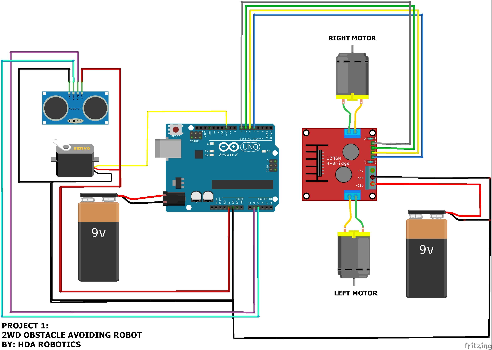

## Robot car with ATmega328p (Arduino chip), made with :package: avr-hal

Working with Rahix's avr-hal to make a little robot :car:🐯 with 📡.

11/08/2020:
Implemented the sensor and the wheels.
15/08/2020:
The car is rolling but the board is making a peeping sound and needs to be restarted
several times on occasions.

The circuit diagram is the same as [this project](https://create.arduino.cc/projecthub/hda-robotics/project-1-2wd-obstacle-avoiding-robot-390ef8).

  

## Get started:

1. Install avrdude.
2. Modify the executable flash_it.sh which contains those lines:

- cargo +nightly build
- flash on the board with: (with your usb serial and your own elf file)
  avrdude -p atmega328p -c arduino -P /dev/tty.usbserial-14430 -U flash:w:target/avr-atmega328p/debug/avr-example.elf:e
- screen /dev/tty.usbserial-14430 57600, if you want to show on the console, if not this can be deleted.

3. you can now run ./flash_it.sh and have the car running (hopefully).

TODO:

- find the cause of the bug
- Continue to organise in structs/Rusty style (the wheels could be passed in a single struct)

✅ Implement PWM for servo motors

- It would not hurt to re-solder the cables (some done)

